# A2DVI Firmware: Digital Video for Apple II Computers

This is a firmware project for a digital DVI/HDMI video card for Apple II.
It directly produces a digital video stream from the Apple II's memory content.
The signal is output via an HDMI connector, connecting the Apple II to modern displays with HDMI (or DVI) inputs.
No more analog signal conversion required.

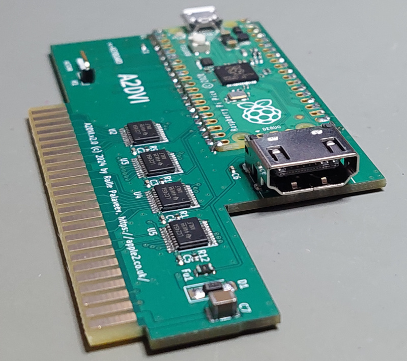

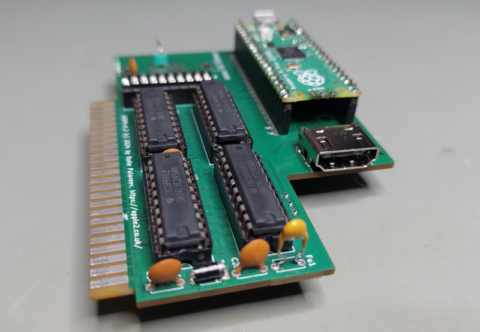

The project is a collaboration with Ralle Palaveev. His related hardware project is here:

* [A2DVI Hardware](https://github.com/rallepalaveev/A2DVI)

The hardware is based on the PICO controller board.
Both, original **PICO (RP2040)** and newer **PICO2 (RP2350)** modules are supported.
Separate firmware is provided for the two PICO variants.

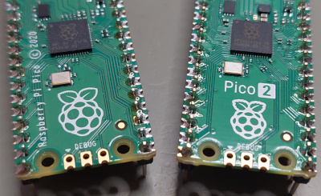

*Currently, there is no difference in A2DVI functionality when using PICO or PICO2.
PICO2 is pin-compatible but has a more powerful CPU, more memory, more flash and improved I/O.
However, the original PICO is capable enough for A2DVI - and still has resources available for future extensions.*

# About the A2DVI-Firmware
The firmware is based on a combination of the Apple II VGA firmware projects by Mark Aikens and David Kuder.
The DVI signal generation is based on the PicoDVI library by Luke Wren.
However, A2DVI uses custom rendering code, to convert the Apple II memory content to a "TMDS" bit stream directly - skipping the intermediate step of generating a VGA buffer for PicoDVI first.

Here's a brief look at the architecture:

<pre>
                      +-------------------------------------------------------------------------+
                      |                   PICO Microcontroller (RP2040 or RP2350)               |
                      |                                                                         |
     +------+         |     +---------+         +-----------------+        +-----------------+  |
     | 6502 |_________|_____| PIO #1  |_________|   ARM Core #1   |________|   ARM Core #2   |  |
     | CPU  |  Apple  |GPIO |I/O State|  32bit  |6502 bus snooping| Shared |PICO DVI + custom|  |
     +------+   Bus   |Pins | Machine |  FIFO   |memory shadowing | Memory |  TMDS rendering |  |
                      |     +---------+         +-----------------+        +-------+---------+  |
                      |                                                         DMA|1.2GByte/s  |
                      |                                                       +----+----+       |
                      |                                                       | PIO #2  |       |
                      |                                                       |I/O State|       |
                      |                                                       | Machine |       |
                      |                                                       +---+++---+       |
                      |                                                       GPIO|||3x252mbit/s|
                      +-----------------------------------------------------------|||-----------+
                                                                            +-----+++------+
                                                                            |HDMI connector|
                                                                            | 640x480@60Hz |
                                                                            +--------------+
</pre>

# Configuration
The firmware supports various configuration properties.
There are configuration utility disks for [ProDOS](https://github.com/ThorstenBr/A2DVI-Firmware/raw/master/configutil/A2DVICONFIG_PRODOS.po) and [DOS3.3](https://github.com/ThorstenBr/A2DVI-Firmware/raw/master/configutil/A2DVICONFIG_DOS33.dsk).

You can also manually type and save the configuration program. It takes just 15 lines of BASIC. See [here](configutil/README.md) for more.

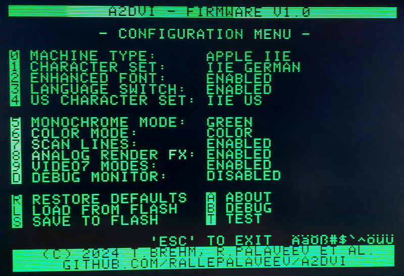

## Machine Type
The A2DVI firmware tries to auto-detect your machine type - and adjusts various features and register sets accordingly.

This also automatically adjusts the character set, if the current selection does not match the machine (with firmware >= v1.1):

* When an Apple IIe is detected, but an Apple II font is selected, it switches to "Apple IIe US character set".
* When an "Apple //e enhanced" is detected, then the "enhanced" variant of the font is used. Otherwise, for the "unenhanced IIe" the "unenhanced" fonts are used (with firmware >= v1.4).
* When an Apple II is detected, but an Apple IIe font is selected, it switches to "Apple II+ US character set".

If you do not want the automatic font switching (i.e. you want to use an Apple II font on the IIe), then disable the auto-detection by setting a *fixed* machine type.

If your A2DVI is installed in a specific/fixed machine, it's recommended to set "machine type" to the matching fixed type.

## Rendering Options
* **Monochrome Mode**: configures the display of monochrome video modes. Selects display as black & white, green or amber (the most popular 1980s CRT types).
* **Color Mode**: configures the display of color video modes. Selects "color" or "monochrome". When "monochrome" is selected, then all video modes are in monochrome.
* **RGB Color Style**: picks the RGB color palette for color video modes (currently only for the 16 color modes, so excluding hires mode).
* 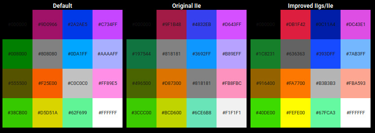
* Note that the original IIe only displayed 15 different colors,
since both gray tones were identical. This was improved with the IIgs. Many games make use of both gray tones. So you may be missing some graphics details when picking the "original IIe" palette.
* 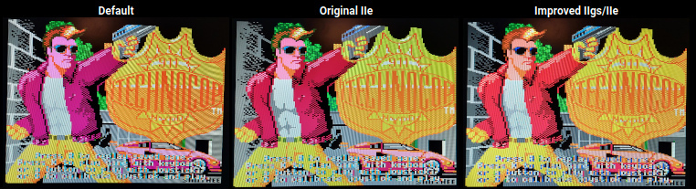
* **Scan Lines**: enables an effect to mimic the look of original CRT screens with scan lines.
* **Analog Rendering Effects**: configures the rendering of double-LORES and double-HIRES video modes.
You can disable the effects, enable them for all modes, or only enable them for double-LORES/HIRES selectively.
Analog rendering effects try to mimic effects of original composite monitors. Graphics of sophisticated games often relied on these display effects.
Recommendation is to enable the effects, or to enable them at least for "double-HIRES" (the highest resolution mode).
For the low resolution mode ("double-LORES") the composite effects are usually not so important (just a matter of taste).

The following screenshots show a comparison of double-HIRES with analog effects disabled (plain rendering) and with the effects enabled:

* The plain rendering shows *perfect pixels*: each pixel has exactly the color as the program dictates.
However, there were no perfect digital displays in the 1980s and this is not how it would have looked. Note how, though the pixels are perfect, you can barely read the copyright text.

* Note how you can now read the copyright text more easily, with "analog effect rendering" enabled.

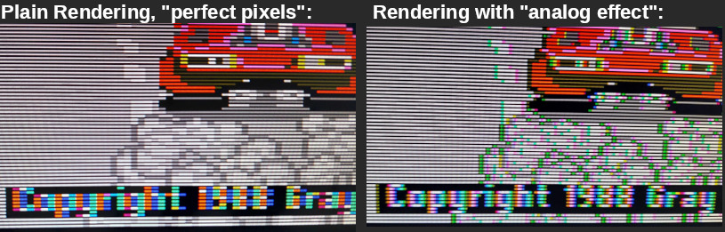

## Built-in Fonts
The firmware has built-in support for various fonts. Additional custom fonts can be uploaded using normal Apple II/IIe video ROM binaries.

Included fonts for Apple IIe:

* **US**, **UK**, **French**, **German**, **Italian**, **Spanish**, **Swedish/Finnish**, **Hebrew**, **Pravetz/Cyrillic**

* For the Apple IIe the "enhanced" or "unenhanced" variant of the IIe font is used - according to the machine type ("Apple IIe" vs "Apple //e enhanced").
The machine is either auto-detected, or can be set manually.
(The difference between the "*enhanced*" and "*unenhanced*" fonts are the graphical "mouse text characters", which only the "Apple //e enhanced" supported.)

Included fonts for Apple II:

* **US**, **VIDEX**, **Katakana**, ...

## Custom Fonts
Custom video ROMs for Apple II and IIe are supported and can be uploaded with the ProDOS/DOS configuration utility.

Supported formats:

* **Apple II 2KB** video ROMs
* **Apple IIe 4KB** video ROMs
* **Apple IIe 8KB** Dual-Language video ROMs

The configuration utility automatically detects the correct format of the uploaded video ROM (based on the file size), since the Apple II and IIe video ROMs used different formats (bit reversed & inverted).

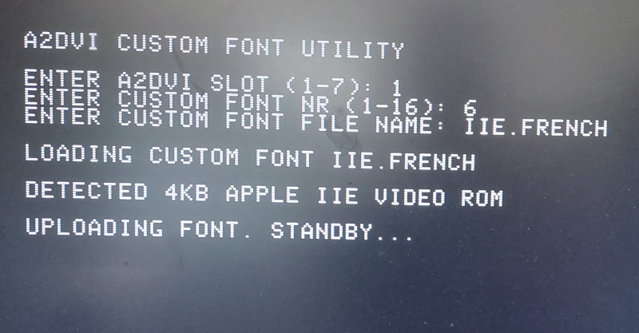

## Configurable Custom Switch/Push-Button
Advanced control options for the "*language rocker switch*" of your Euro-Apple IIe are configurable.
For machines without this switch, you can install a custom push button or rocker switch and connect it to the "ALTCHR" input of A2DVI.

The switch normally toggles the machine's character set (local language vs US character set).
You can enable advanced behavior, so quickly rocking the switch back and forth changes the display mode.
So you no longer need to enter the configuration menu in order to change between color, monochrome or other display modes.

Menu options for switching behavior:

* **DISABLED**: input switch does nothing.
* **TOGGLE CHARACTER SET**: switch controls the character set only (original Euro-Apple IIe default behavior).
* **TOGGLE MONO/COLOR**: switch selects monochrome or color display mode.
* **CYCLE DISPLAY MODE**: switch cycles through various display modes (color, black&white, green, amber - with/without scanlines). The cycled options depend on the currently active video mode.
* **CHARSET+TOGGLE M/C**: switch controls the character set. Quickly rocking the switch back and forth toggles color vs monochrome mode.
* **CHARSET+CYCLE MODES**: switch controls the character set. Quickly rocking the switch back and forth cycles through available display modes (see above).

Use the ALTCHR language switch (Euro-Machines) or connect a custom switch/push-button to quickly cycle the available display modes:

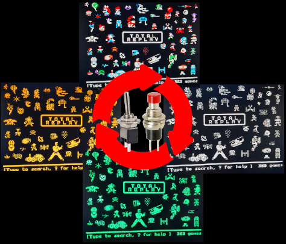

The new display configuration is briefly shown below the screen area when using the rocker switch/push button to cycle the mode:

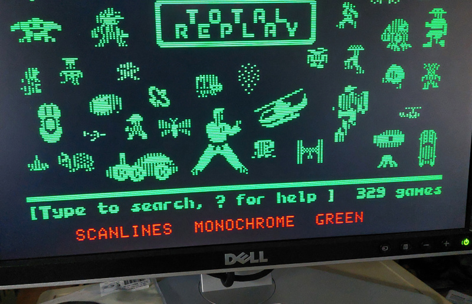

See [here](doc/Installation.md) for more details about the installation of a custom external switch / connecting to the language rocker switch.

## Dual Language Support for Euro-Machines
The A2DVI-Firmware has dual language support.
If you have a "Euro-Apple IIe" with the language switch on the bottom side of your Apple II keyboard,
then select "**ALTCHR SWITCH: TOGGLE CHARACTER SET**" (or one of the advanced modes) in the configuration utility and select, both,
the primary and secondary character set (primary is any font/character set, secondary is any US character set).

If you don't know what the language switch on the Euro Apple IIs was for, see this video:
[https://www.youtube.com/watch?v=cvEjy_uI0gY](https://www.youtube.com/watch?v=cvEjy_uI0gY)

In order for the language switch to work, an additional wire needs to be installed.
Connect the single pin on the A2DVI card to the language switch signal "ALTCHR", at J19, front pin facing towards the keyboard:

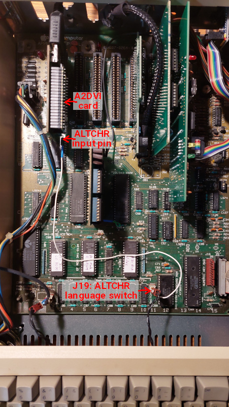

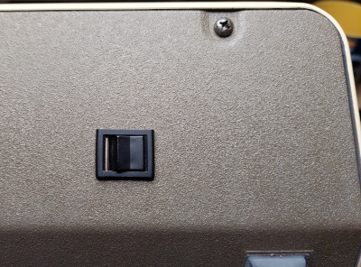

## Video7 Support
Video7 provided additional color text and video modes for the Apple IIe.
Some of these modes were also available with other video cards, like the "Apple Extended 80 column Text/AppleColor Card".

A2DVI supports these extended video modes - even if your Apple IIe only has a standard 80 column card (and no extended video card).

The extra video modes:

* 40 column **color** text
* 280x192 with 16 colors
* 160x192 with 16 colors
* 140x192 with 16 colors mixed with high resolution (560pixel/line) monochrome pixel option (enhanced DHGR)

The following photo shows the difference of the default vs enhanced DHGR video mode (as supported by DazzleDraw).
This video mode provides a mix of 140x192 pixels in 16 colors (just like default DHGR),
but uses an unused 8th data bit to switch to a 560pixel/line monochrome resolution for a block of 7 bits:

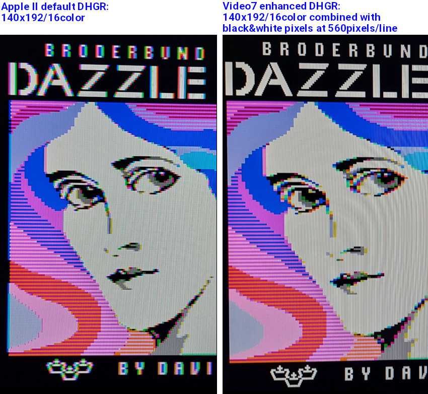

Another example showing the Video7 16color with hires monochrome pixel mix mode:

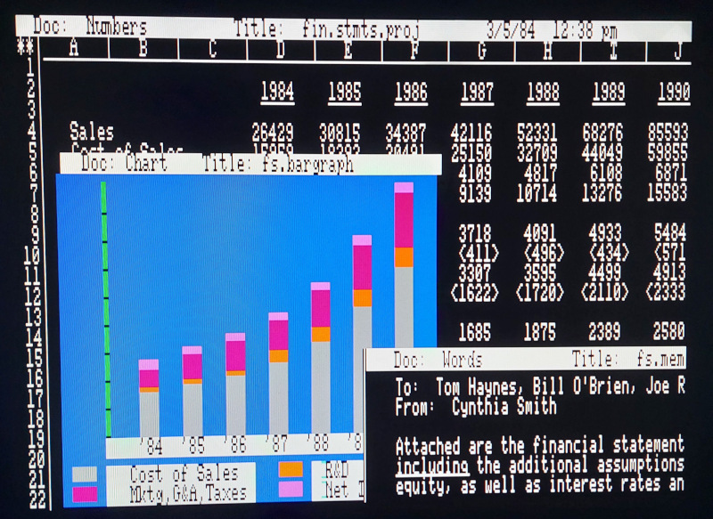

## Videx Support
Stock Apple IIs did not support 80 column display.
A popular extension were "Videx" video cards, which provided 80 column support - and support for various character sets.

A2DVI is able to display the Videx 80 column video mode on an Apple II.
Enable the Videx support by selecting the Videx character set in the menu (US, German, French, Spanish, ...).

The Videx support of A2DVI is currently "passive" only:

* You need to have an original Videx card plugged into slot 3 of your Apple II (the original card provides a ROM, registers and additional RAM to your Apple II).
* Plug your A2DVI card in any other slot.

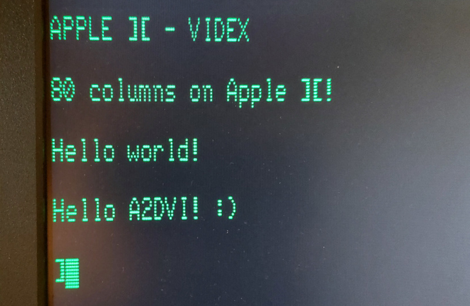

## Debug Monitor
The configuration menu offers a debugging feature. Enabling the "**DEBUG MONITOR**" shows extra lines above and below the normal Apple II screen (in red):

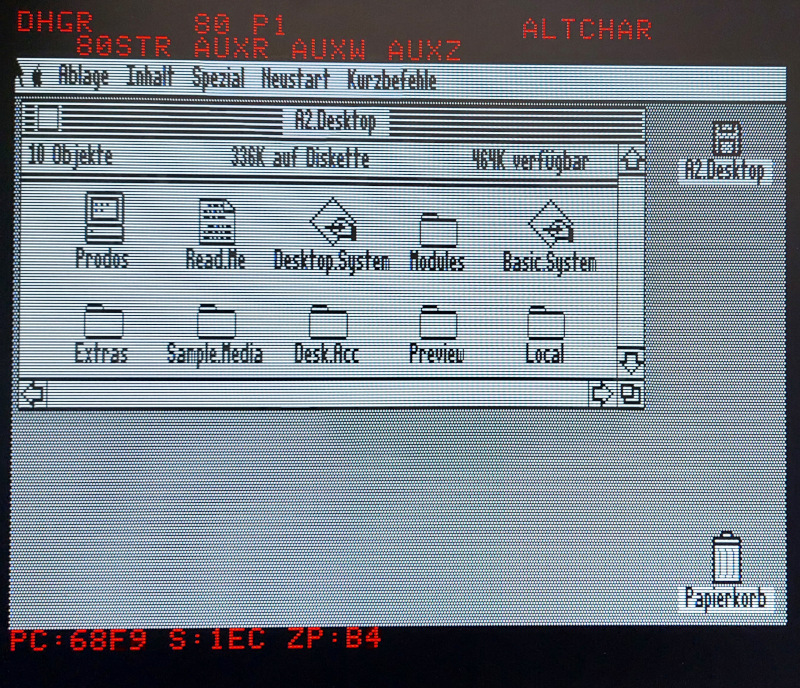

The first line shows the status of switches controlling Apple II's video subsystem:

* **TEXT**, **GR** (LORES graphics), **DGR** (double LORES), **HGR** (HIRES), **DHGR** (double HIRES): the active video mode.
* **MIX**: text/graphics mix mode enabled.
* **40**/**80**: 40/80 column display mode selected.
* **P1**/**P2**: Display page 1 or 2 selected.
* **MONOCHROME**: Monochrome mode selected.
* **ALTCHAR**: Alternate characters selected.
* **V7:n**: Selected Video7 mode.

The second line shows *soft switches* controlling Apple II(e)'s memory subsystem:

* **80STR**: 80STORE is selected (page 2 switches between main/auxiliary memory, instead of toggling P1/P2 pages).
* **AUXR**: Auxiliary Read is selected (reading from auxiliary memory, beyond 64KB).
* **AUXW**: Auxiliary Write is selected (writing to auxiliary memory, beyond 64KB).
* **AUXZ**: Auxiliary Zero-Page is selected (zero-page in auxiliary memory).
* **C3ROM**: Slot 3 ROM is disabled (memory bank enabled).
* **CXROM**: CX00 ROM area is disabled (memory bank enabled).
* **IOUD**: "IOU disable" is selected (IOU access for addresses $C058 to $C05F disabled).

The line below the Apple II screen shows 6502 activity:

* **PC**: current program counter (6502 execution address).
* **S**: stack pointer (in fact: most recent memory access to stack page).
* **ZP**: most recent address accessed in zero-page.

The displayed program counter and stack pointer isn't exact science. Of course, the 6502 runs to far quickly to see all addresses. And the card doesn't know the register contents of the 6502, however, it sees every bus cycle and every memory access. So it sees access to the stack area (0x100-0x1ff) and the addresses of instruction fetches.
This can be helpful when debugging a program. It's also just cool (though maybe a bit nerdy :) ) to be able to see what the 6502 is currently doing.

## ROMX Support
The A2DVI firmware supports the font selection protocol of ROMX/ROMXe devices.

* ROMX supports selecting between 16 different fonts.
* A2DVI maps the 16 fonts selected by ROMX to A2DVI's 16 custom font slots. So you can upload and change those 16 fonts as you wish.
* When ROMX selects an empty custom font slot (1-16), then one of the built-in fonts (1-16) is used instead.

## Startup Diagnostics
When the Apple II does not appear to boot, a diagnostics screen is displayed instead, showing the state of the 6502 bus.
This may become helpful with *certain type* of Apple II mainboard defects.

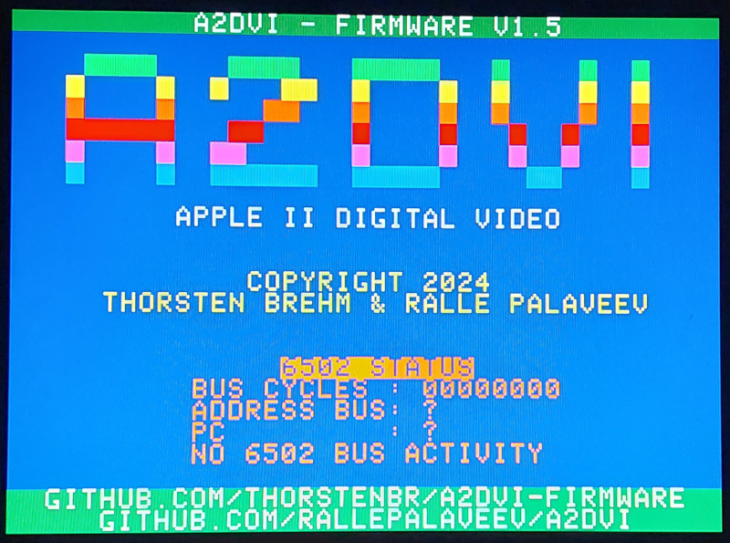

# Photos
Here are some photos showing A2DVI in action - using the DVI/HDMI connection.

*Yes, I know you cannot tell from blurry photos whether these were from an analog or digital connection - or even from an emulator. But - trust me...* :D

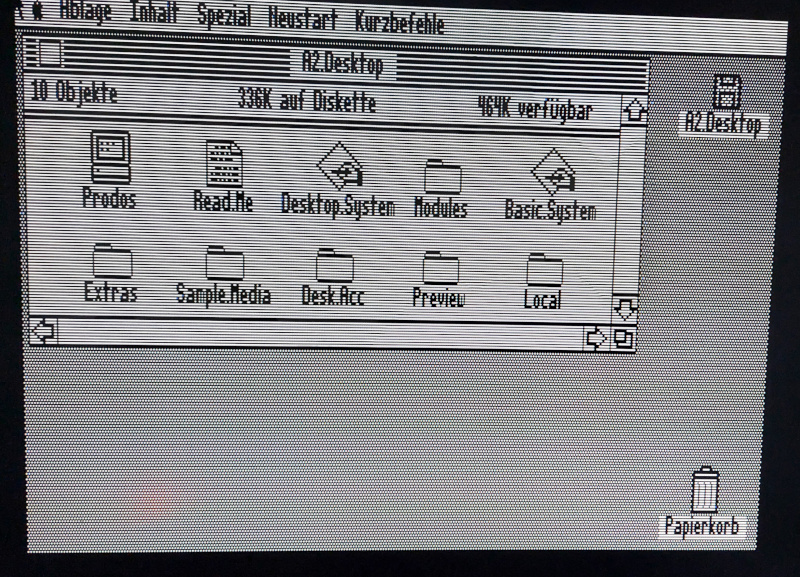
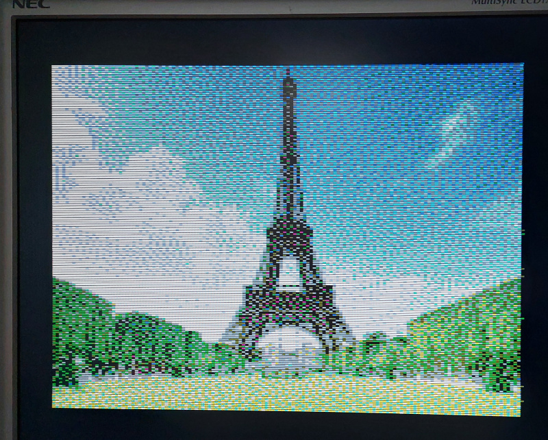
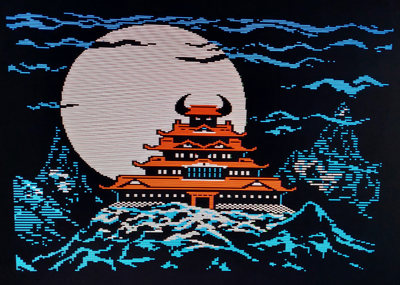
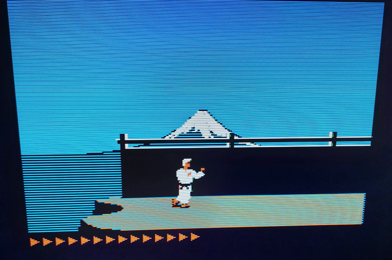
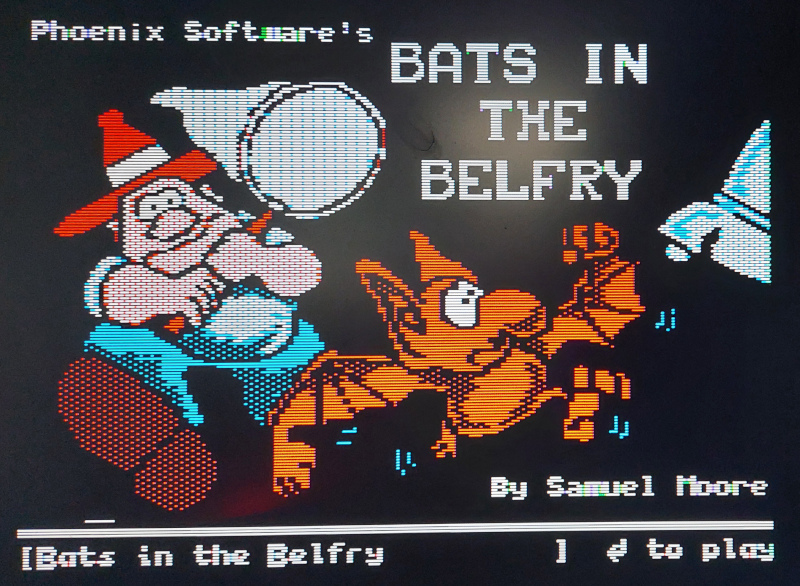
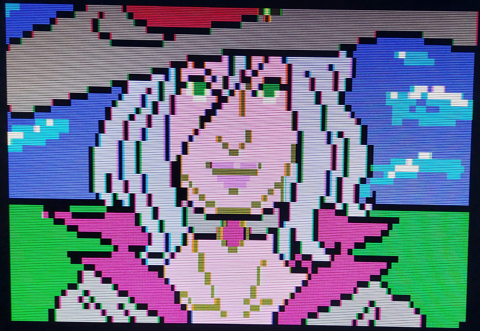

# Firmware Updates
Firmware updates of an A2DVI card are easy and safe:

1. Switch off your Apple II. (*It's otherwise safe to update the A2DVI card while it is still plugged in the Apple II.*)
2. Press the white "BOOTSEL" button on top of the A2DVI's PICO module. *Keep the button depressed.*
3. While the button is still depressed, connect the USB cable between your PC/Mac and the PICO module.
4. Your PC/Mac should recognize a new mass storage device.
5. Drag & drop the firmware file from the Release's ZIP-file (e.g. "A2DVI-vX.Y.uf2", see [Releases](https://github.com/ThorstenBr/A2DVI-Firmware/releases)) to the mass storage drive.
6. After 2 seconds the LED should light up. The firmware update is complete.
7. Disconnect the USB cable. Switch on the Apple II... :)

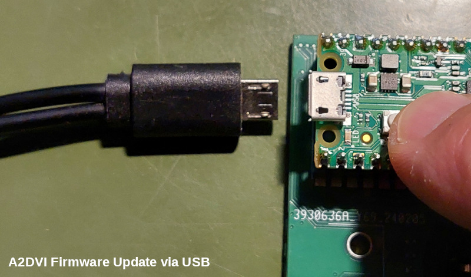

# Project Status: Completed Features

* **40/80 column text modes** for Apple IIe
* **40 column text mode** for Apple II
* **VIDEX 80 column text** for Apple II
* **LORES graphics mode**
* **Double-LORES graphics mode**
* **HIRES graphics mode**
* **Double-HIRES graphics mode**
* **Graphics/text mix modes**
* **Video-7 40 column color mode**
* **Advanced Video7 graphics modes**
* **Scanline emulation**
* **Monochrome mode**, configurable **monochrome color** (b/w, green, amber).
* **Character sets** configurable (16 builtin, 16 custom fonts).
* **Language/rocker switch** support for Euro-machines.
* **Flash** (permanent) vs temporary configuration.
* **Card registers** for configuration.
* **Configuration menu**.
* **Debug monitor** (Apple II video soft switches, 6502 CPU state).
* **PICO2 (RP2350) support**.
* **Analog rendering effects** for Double-HIRES/Double-LORES (optional).
* **ROMX font selection**.
* **Display modes switchable through ALTCHR language switch or custom switch/push-button**
* **Multiple color palettes**
* **Simple Startup Diagnostics**

# License
The A2DVI firmware is released under the [MIT License](https://github.com/ThorstenBr/A2DVI-Firmware/blob/master/LICENSE):

* Copyright (c) 2024 Thorsten Brehm

A2DVI was an idea by Ralle Palaveev. His matching hardware project:

* [A2DVI Hardware](https://github.com/rallepalaveev/A2DVI). MIT License. Copyright (c) 2024 Ralle Palaveev.

The firmware project is based on awesome work from the following Apple II Analog VGA projects:

* [AppleII-VGA](https://github.com/markadev/AppleII-VGA). MIT License. Copyright (c) 2021-2022 Mark Aikens.

* [Analog Firmware](https://github.com/V2RetroComputing/analog-firmware). MIT License. Copyright (c) 2022-2023 David Kuder.

This project uses a customized variant of the PicoDVI library - and reuses many of Luke's genius ideas for the custom *Apple II to DVI/TMDS* encoding:

* [PicoDVI](https://github.com/Wren6991/PicoDVI). [BSD3 License](/libraries/libdvi/LICENSE). Copyright (c) 2021 Luke Wren.

 

*Apple II Forever!*
