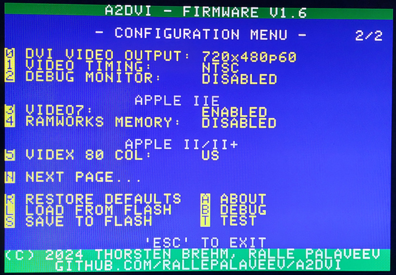

# A2DVI Configuration

The firmware supports various configuration properties.

## Configuration Disks
There are configuration utility disks

* based on [ProDOS](https://github.com/ThorstenBr/A2DVI-Firmware/raw/master/configutil/A2DVICONFIG_PRODOS.po) (requires a //e with 48K RAM or more).

* based on [DOS3.3](https://github.com/ThorstenBr/A2DVI-Firmware/raw/master/configutil/A2DVICONFIG_DOS33.dsk) (any Apple II).

These support configuration of the card and also uploading custom fonts (video ROMs).

Download the files and transfer them to a disk, for example, using ADTPro.

## Configuration Utility
Alternatively, you can type the program and save it to a disk manually.
The menu is implemented inside the A2DVI firmware, so it takes just a
couple of lines to activate it.

This is just how you would have done it back in the 80s, when manually
copying and typing program listings from magazines was common... :)

    10 HOME : PRINT "ENTER A2DVI SLOT (1-7): ";
    20 GET S
    30 IF (S<1) OR (S>7) THEN GOTO 20
    40 PRINT "LOOK AT YOUR A2DVI SCREEN!"
    50 VTAB 21
    60 S = -16256 + S*16
    70 POKE S+15,11
    80 POKE S+15,22
    90 POKE S+9,0
    100 GET A$
    110 C = ASC(A$)
    120 POKE S+9,C
    130 IF C <> 27 THEN GOTO 100
    140 POKE S+15,0
    150 HOME : PRINT "GOODBYE!"

This is a shortened version, which does not support uploading custom video ROMs.
The full version of the utility, which is used on the disk images above, is also available [here](A2DVICONFIG.BAS).
